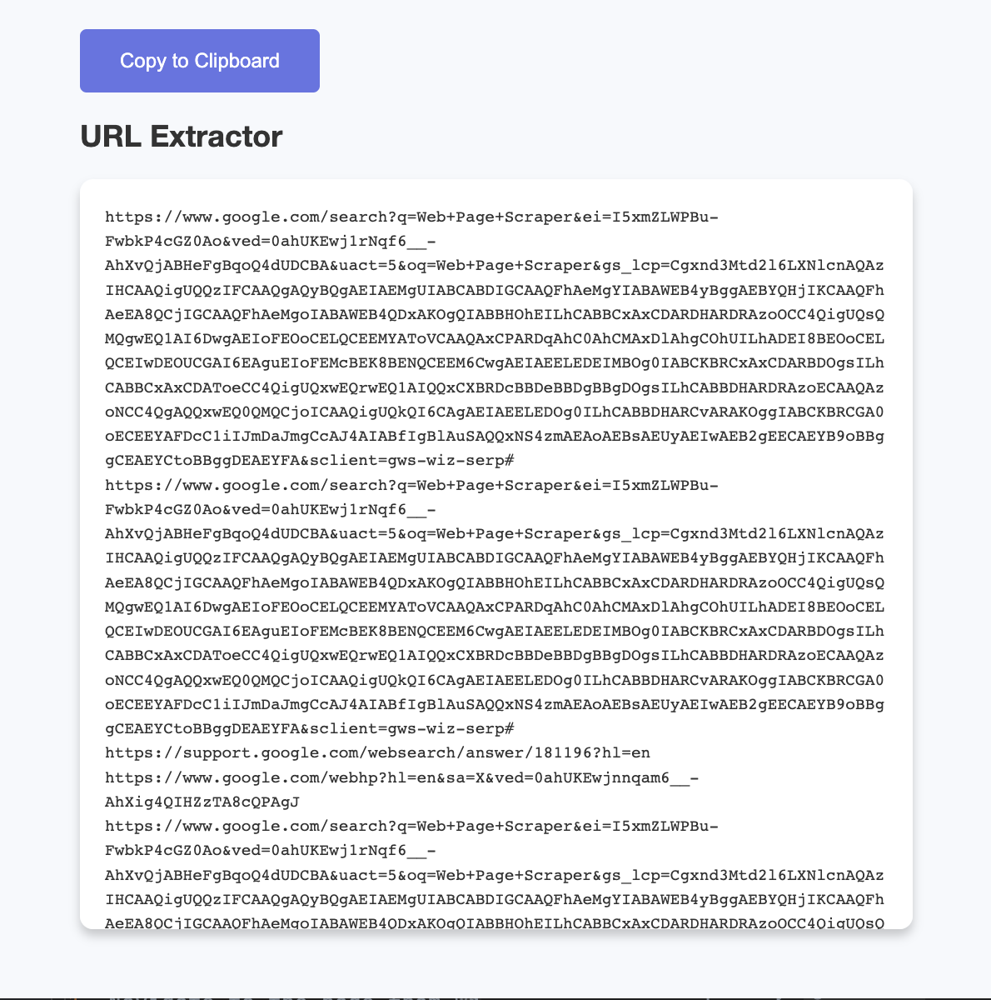

# 🕸 URL Extractor - Chrome Extension

URL Extractor is a Chrome Extension that extracts all URLs 🔗 on the active tab and provides them in a popup for easy copying to clipboard.

## Installation

1. Clone this repository: `git clone git@github.com:michaelwalkerfl/url_extractor.git`
2. Open Google Chrome and navigate to `chrome://extensions`.
3. Enable "Developer mode" by toggling the switch in the top right corner.
4. Click on "Load unpacked" and select the directory of the cloned repository.

## Usage

1. Navigate to the page from which you want to extract URLs.
2. Click on the URL Extractor icon in the Chrome extensions toolbar.
3. A popup will appear displaying all URLs present on the active tab.
4. Click on the "Copy to Clipboard" button to copy all URLs.
5. A message "URLs Copied!" will be displayed when the URLs have been successfully copied to your clipboard.

## Contributing

Contributions, issues, and feature requests are welcome! Feel free to check the [issues page](https://github.com/michaelwalkerfl/url_extractor/issues).

## License

This project is [MIT](https://choosealicense.com/licenses/mit/) licensed.
